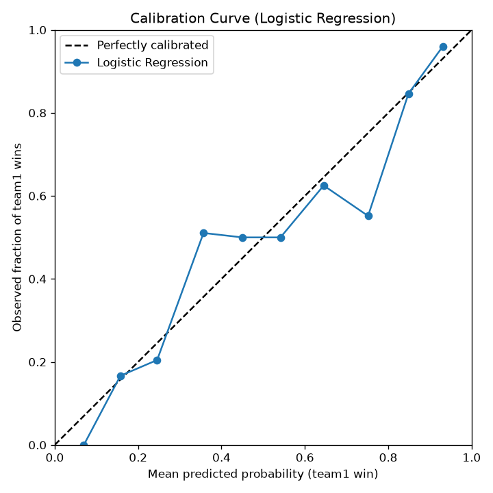

# LoL Worlds 2026 Champion Predictor

**Predicting the winner of the League of Legends World Championship using ELO ratings, machine learning, and tournament simulation.**

---

## Project Overview

This project builds an end-to-end prediction system for the League of Legends World Championship. Using professional match data from Oracle's Elixir, we:

1. **Build a league-strength-adjusted ELO system** (K-factor scaled by region strength; larger updates for international games)
2. **Engineer pre-game features** (form, streaks, head-to-head)
3. **Train and compare machine learning models** on a temporal split to predict match outcomes
4. **Simulate the Worlds 2026 tournament** to estimate each team's title odds
5. **Backtest** the whole pipeline against Worlds 2023-2025

---

## Data Source

- **Oracle's Elixir**: https://oracleselixir.com/tools/downloads
- Professional match data from 2026 season
- Includes team stats, objectives, gold, and match results

---

## Tech Stack

| Language/Tool | Purpose |
|---------------|---------|
| **Python** | Main programming language |
| **Pandas** | Data manipulation and analysis |
| **NumPy** | Numerical operations |
| **Scikit-learn** | Machine learning models |
| **XGBoost** | Advanced ensemble model |
| **Matplotlib/Seaborn** | Data visualization |
| **Git** | Version control |

---

## Project Structure

```
lol_worlds_predictor2/
├── data/
│   ├── raw/                      # Original Oracle's Elixir data (gitignored)
│   └── processed/                # Cleaned and engineered data (gitignored)
├── src/
│   ├── config.py                 # Configuration settings
│   ├── explore_data.py           # Quick look at the raw data
│   ├── data_preparation.py       # Phase 1: Clean and aggregate data
│   ├── elo_system.py             # Phase 2: Build ELO ratings
│   ├── feature_engineering.py    # Phase 3: Create features
│   ├── model_training.py         # Phase 4: Train and compare models
│   ├── tournament_simulation.py  # Phase 5: Simulate Worlds
│   └── backtest.py               # Walk-forward backtest vs. Worlds 2023-2025
├── results/
│   ├── model_comparison.csv      # Model accuracy / calibration comparison
│   ├── calibration_plot.png      # Reliability curve for the best model
│   ├── backtest_summary.csv      # Walk-forward backtest results
│   └── worlds_prediction_full.csv # Champion probabilities
├── requirements.txt              # Python dependencies
├── .gitignore                    # Files to exclude from Git
└── README.md                     # Project documentation
```

---

## Methodology

### Phase 1: Data Preparation (`data_preparation.py`)

**Goal:** Convert raw player-level data into clean team-level data.

| Step | Description |
|------|-------------|
| 1 | Load raw Oracle's Elixir data (100,128 rows, 165 columns) |
| 2 | Tag international matches (FST, EWC, MSI) |
| 3 | Filter to major regions (LCK, LPL, LEC, LCS, CBLOL, LCP) plus the international events |
| 4 | Aggregate from player-level to team-level |
| 5 | Handle missing values (fill objectives with 0) |
| 6 | Sort chronologically for time-series processing |
| 7 | Save prepared data (5,160 rows, 35 columns) |

**Key Decision:** Only include teams from regions that qualify for Worlds. This ensures the model focuses on relevant data.

---

### Phase 2: ELO System (`elo_system.py`)

**Goal:** Assign a dynamic strength rating to every team.

**How ELO Works:**

```
Expected Score = 1 / (1 + 10^((R_opponent - R_team) / 400))
New Rating      = R_team + K * (Actual_Result - Expected_Score)
```

**Key Parameters:**

| Parameter | Value | Why |
|-----------|-------|-----|
| Base ELO | 1200 | Standard starting point |
| K (Regional) | 32 | Adjusted by league strength |
| K (International) | 48 | International matches matter more |

**League Strength Factors:**

| Region | Strength Factor | Why |
|--------|-----------------|-----|
| LCK | 1.00 | Strongest region |
| LPL | 0.92 | Second strongest |
| LEC | 0.85 | Third strongest |
| LCS | 0.69 | Weaker region |
| CBLOL | 0.54 | Weak region |
| LCP | 0.46 | Weakest region |

**League Strength Adjustment:**

For domestic matches, the K-factor is scaled by the average strength of the
two teams' leagues:

```
avg_strength = (team_strength + opp_strength) / 2
K            = K_BASE * avg_strength
```

So wins in stronger regions (LCK) move ratings more than wins in weaker
regions (LCP).

**Output:** ELO ratings for all 63 teams in the dataset, scaled to 1000-1600 range.

**Top 10 Teams After ELO:**

| Rank | Team | League | ELO |
|------|------|--------|-----|
| 1 | Bilibili Gaming | LPL | 1600 |
| 2 | Gen.G | LCK | 1512 |
| 3 | T1 | LCK | 1445 |
| 4 | Hanwha Life Esports | LCK | 1409 |
| 5 | Karmine Corp | LEC | 1393 |
| 6 | G2 Esports | LEC | 1393 |
| 7 | Dplus Kia | LCK | 1311 |
| 8 | Anyone's Legend | LPL | 1308 |
| 9 | Team Liquid | LCS | 1295 |
| 10 | LYON | LCS | 1291 |

---

### Phase 3: Feature Engineering (`feature_engineering.py`)

**Goal:** Create predictive features for machine learning.

| Feature | Description | Why It Matters |
|---------|-------------|----------------|
| `elo_diff` | team1_elo - team2_elo | Relative strength difference |
| `h2h_win_rate` | Head-to-head win rate | Matchup-specific advantage |
| `team1_form_5` | Win rate in last 5 games | Short-term momentum |
| `team2_form_5` | Win rate in last 5 games | Opponent momentum |
| `team1_form_10` | Win rate in last 10 games | Medium-term consistency |
| `team2_form_10` | Win rate in last 10 games | Opponent consistency |
| `team1_streak` | Current win/loss streak | Momentum indicator |
| `team2_streak` | Current win/loss streak | Opponent momentum |

**Feature Correlation with Winning:**

| Feature | Correlation | Strength |
|---------|-------------|----------|
| h2h_win_rate | **0.508** | Strongest |
| elo_diff | **0.333** | Second strongest |
| team2_form_5 | -0.164 | Weak (negative) |
| team1_form_5 | 0.130 | Weak |

---

### Phase 4: Model Training (`model_training.py`)

**Goal:** Find the best model for predicting match outcomes.

**Train/test split:** temporal, not random. The 2,580 feature rows are sorted
by date; the model trains on the earliest 80% (2,064 matches through
2026-08-01) and is tested on the most recent 20% (516 matches, 2026-08-01 to
2026-09-05). This is the honest setup for a forecasting task: the model never
sees a future match at training time. A random split leaks future information
and inflates Logistic Regression accuracy from 66.9% to about 71%.

**Models Tested (temporal split):**

| Model | Accuracy | Verdict |
|-------|----------|---------|
| **Logistic Regression** | **66.86%** | **Best Model** |
| Random Forest | 64.73% | Good |
| XGBoost | 62.40% | Good |

**Why Logistic Regression Won:**

| Reason | Explanation |
|--------|-------------|
| Small dataset | 2,580 rows is small for complex models |
| Linear relationships | Features have roughly linear relationships with winning |
| No overfitting | Logistic Regression generalizes better |
| Feature engineering | Heavy lifting was already done |

**Feature Importance (Logistic Regression, standardized coefficients):**

Features are standardized with `StandardScaler` (fit on the training set only)
before fitting, so the coefficients below are on a comparable scale even though
`elo_diff` has a much larger raw range than the win-rate and form features.

| Feature | Std. Coefficient | Impact |
|---------|------------------|--------|
| h2h_win_rate | 1.41 | Most important |
| team2_form_10 | -0.19 | Second most important |
| team2_form_5 | 0.13 | Third most important |
| elo_diff | -0.10 | Small |
| team1_streak | -0.08 | Minimal impact |
| team1_form_5 | 0.05 | Minimal impact |
| team1_form_10 | 0.04 | Minimal impact |
| team2_streak | 0.00 | Minimal impact |

**Key Insight:** Head-to-head win rate is by far the most important feature. This suggests that matchup-specific history matters more than overall team strength.

**Probability Calibration:**

Accuracy alone isn't enough here. `tournament_simulation.py` feeds each model's
predicted win probability into a Monte Carlo simulation, so miscalibration
compounds across the 10,000 simulated matches. For every model we also report
**Brier score** and **log loss** on the test set (both lower is better), and
save a reliability curve for the best model to `results/calibration_plot.png`.

| Model | Brier | Log Loss |
|-------|-------|----------|
| **Logistic Regression** | **0.198** | **0.574** |
| Random Forest | 0.205 | 0.594 |
| XGBoost | 0.220 | 0.631 |

Logistic Regression has the best-calibrated probabilities as well as the best
accuracy, so it's the one used for the tournament simulation.



The curve roughly follows the diagonal but is noisy (the test set is only 516
matches), with some over-confidence at the low end and a dip near 0.75.

---

### Phase 5: Tournament Simulation (`tournament_simulation.py`)

**Goal:** Simulate the full Worlds 2026 tournament bracket to predict the champion.

**Tournament Format:**
- **Swiss Stage:** 20 teams → 8 teams advance
- **Knockout Stage:** Quarterfinals → Semifinals → Finals

**Worlds 2026 Qualifying Teams:**

| Region | Teams |
|--------|-------|
| LCK | T1, Gen.G, Hanwha Life Esports, Dplus Kia |
| LPL | Bilibili Gaming, Top Esports, Anyone's Legend, JD Gaming |
| LEC | G2 Esports, Karmine Corp, Team Vitality |
| LCS | LYON, Team Liquid, Cloud9 |
| LCP | Team Secret Whales, GAM Esports |
| CBLOL | LØS |
| Play-in | FURIA, RED Canids, Sentinels |

**Simulation Method:**

- Simulated tournament **10,000 times**
- Each match predicted using the **Logistic Regression** model
- Swiss stage: top 8 teams by ELO advance
- Knockout stage: fixed bracket (1st vs 8th, 2nd vs 7th, etc.)
- Champion with most wins declared predicted winner

---

### Backtest / Validation (`backtest.py`)

**Goal:** Check whether the pipeline would have been useful in past years
instead of only trusting it on the 2026 prediction.

`backtest.py` runs a walk-forward backtest against Worlds 2023, 2024 and
2025. For each year it:

1. Retrains the model on only the matches that finished before that year's
   Worlds started (no look-ahead).
2. Re-runs the tournament simulation for that year's real participant list
   and reads off championship probabilities.
3. Compares the result to:
   - what actually happened: did the model's top pick win, and what
     probability and rank did it give the eventual champion?
   - a baseline: accuracy of picking the higher-ELO team in every game that
     was actually played at that Worlds.

The Worlds start date, participant list and actual champion are all read
from the data, so nothing about the outcomes is hard-coded.

**Data needed:** the 2023-2025 Oracle's Elixir yearly CSVs in `data/raw/`
(adding 2022 gives the 2023 training slice more history). Output is written
to `results/backtest_summary.csv`.

```bash
python src/backtest.py           # 10,000 simulations per year
python src/backtest.py 2000      # optional: fewer simulations, faster
```

**Backtest results (2023-2025 CSVs, 10,000 sims/year):**

| Year | Actual champ | Model's pick (prob) | Champ's odds (rank) | Model match acc. | Higher-ELO baseline |
|------|--------------|---------------------|---------------------|------------------|---------------------|
| 2023 | T1 | JD Gaming (39%) | 2.0% (8th) | 55.8% | 58.4% |
| 2024 | T1 | Gen.G (38%) | 11.8% (3rd) | 60.4% | 60.4% |
| 2025 | T1 | Gen.G (57%) | 7.6% (3rd) | 59.5% | 67.9% |

**Takeaways:**

- The model's top pick won 0 of 3 backtested Worlds, and so did the
  higher-ELO team. T1 won all three despite never leading regular-season ELO.
- On per-match accuracy the model trails the "pick the higher-ELO team"
  baseline by about 3.7 points on average (58.6% vs 62.2%). The extra
  features (form, streaks, h2h) are not adding signal at Worlds.
- Treat the 2026 prediction as a rough prior, not a forecast.

---

## Results

### Model Performance (temporal test set, 516 matches)

| Model | Accuracy | Brier | Log Loss |
|-------|----------|-------|----------|
| **Logistic Regression** | **66.86%** | **0.198** | **0.574** |
| Random Forest | 64.73% | 0.205 | 0.594 |
| XGBoost | 62.40% | 0.220 | 0.631 |

Brier and log loss are probability-quality metrics (lower is better).
Reliability curve for the best model: `results/calibration_plot.png`.

### World Champion Probabilities (10,000 Simulations)

Only the eight teams seeded into the bracket (top 8 by ELO) can win under the
current simulation format, so the probabilities below sum to 100% across
those eight.

| Team | Region | Win Probability |
|------|--------|-----------------|
| **Dplus Kia** | LCK | **24.58%** |
| **Bilibili Gaming** | LPL | **23.66%** |
| **Hanwha Life Esports** | LCK | **16.54%** |
| **G2 Esports** | LEC | **11.65%** |
| **Karmine Corp** | LEC | **6.32%** |
| **Gen.G** | LCK | **6.26%** |
| **Anyone's Legend** | LPL | **5.55%** |
| **T1** | LCK | **5.44%** |

These numbers are volatile: the model leans heavily on head-to-head history,
so a few lopsided past matchups swing the bracket. The backtest below shows
this framing has not actually called a past Worlds champion correctly, so
treat the table as a rough prior rather than a real forecast.

### Key Insight

**Head-to-head win rate** was the most important predictor, followed by
opponent recent form. This is also a weakness: at Worlds, where teams rarely
have meaningful head-to-head history, the feature adds noise more than signal
(see the backtest).

---

## How to Run

### 1. Clone the Repository

```bash
git clone https://github.com/Sadmanshayan10/lol_worlds_predictor2.git
cd lol_worlds_predictor2
```

### 2. Set Up Virtual Environment

```bash
python3 -m venv .venv
source .venv/bin/activate  # On Mac/Linux
# .venv\Scripts\activate   # On Windows
```

### 3. Install Dependencies

```bash
pip install -r requirements.txt
```

### 4. Download Data

- Download the 2026 season file from [Oracle's Elixir](https://oracleselixir.com/tools/downloads)
- Place it in `data/raw/`
- If you also drop in the 2023-2025 files for the backtest, the main
  pipeline still uses the most recent season (highest year in the filename).

### 5. Run the Pipeline

Each script resolves its input/output paths relative to its own location
(`src/`), so you can run the phases from any working directory and the
commands below work as written.

```bash
# Phase 1: Data Preparation
python src/data_preparation.py

# Phase 2: ELO System
python src/elo_system.py

# Phase 3: Feature Engineering
python src/feature_engineering.py

# Phase 4: Model Training
python src/model_training.py

# Phase 5: Tournament Simulation
python src/tournament_simulation.py
```

### 6. (Optional) Backtest Against Past Worlds

Download the 2023-2025 Oracle's Elixir yearly CSVs into `data/raw/`, then:

```bash
python src/backtest.py
```

This walk-forward backtests the pipeline against Worlds 2023-2025 and writes
`results/backtest_summary.csv`. See **Backtest / Validation** above.

---

## License

MIT

## Author

Sadmanshayan ([GitHub](https://github.com/Sadmanshayan10))

## Acknowledgments

- [Oracle's Elixir](https://oracleselixir.com/) for the match data
- Riot Games for the game
- The scikit-learn, XGBoost, and pandas maintainers
